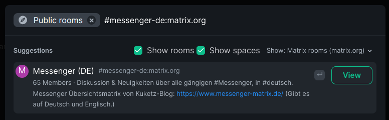
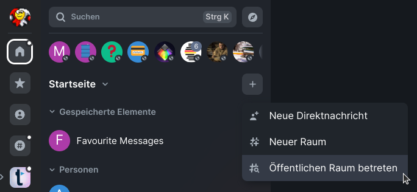

Space with Rooms about Matrix which are not in [#community:matrix.org](https://matrix.to/#/#community:matrix.org):  
[](https://matrix.to/#/#free-messengers:matrix.org) 

## Which Server 
### Should I choose  
Here is a list of potential servers:  
https://joinmatrix.org/servers/  

### Should I NOT Choose
Servers which a recommend by this list shouldn't be choosen:  
https://tatsumoto-ren.github.io/blog/list-of-matrix-servers.html  
The author of this list ist trying to get people to "malicious" servers to raise the pressure removing their servers from the ban lists. This won't happen and you will not be able to join many rooms!  

### My Personal Choice
#### Why
A couple of time ago I switched from tchncs.de to matrix.org because I was missing a feature (view.matrix.org which is deprecated today)  
I questioned: I am missing feature, will I missing a feature in the Future?  
I only knew matrix briefly and switched from XMPP, where every Client and Server has another Featureset....  
matrix.org is a test server and therefore has all (beta) Feature.  
  
I wanted to convince more people to matrix and that was my Checklist:  
- simple as possible like SSO via e.g google. (Despite I don't use it and advice against it, i logged in 99% of the people this way...)
- It would be good using the same like other People who i show Matrix. e.G. for better understanding errors.

#### Cons of matrix.org
- matrix.org is by far the biggest Server. Such a decentralisation isn't good, but in my opinion should be the first goal getting e.G. WhatsApp Users to Matrix...
And the long time goal is to shut off matrix.org https://youtu.be/C2eE7rCUKlE?t=1213
- matrix.org is slower then other Matrix Servers and sometimes there are (short) connection losses.

#### Why don't you use your own Matrix Server?
I have an own Matrix Server which i use for bridging private Chats from other Messengers. But i don't care really much if it works. I don't want to be careless towards matrix, thats the reason why i don't use my own Matrix Server.

#### My recommendation for Bridging
- For private Chats the best thing would be an own Matrix Server. If you don't want to use an own Server I recommend https://tchncs.de/matrix#bridges
- For Briding whole rooms for the public I recommend https://t2bot.io/ and https://tchncs.de/matrix#bridges  
(For XMPP Bridging I recommend https://aria-net.org/SitePages/Portal/Bridges.aspx )

## How to join a Room with a room alias
If you have a Room alias and want to join this room, you have to insert it in the public room search.
  
If the Room was found in the Room directory the search result states as following:  
  
If the Room was not found in the Room directory the search result states as following:  
  
In both cases you can join the Room.

## Send custom reactions in Element to messages 
1. Chat /devtools
2. Send Custom Event
3. 
Event Type: `m.reaction`
Event Content: 
```{
    "m.relates_to": {
        "rel_type": "m.annotation",
        "event_id": "$164569109460761pvPSY:matrix.org",
        "key": "BOMP!"
    }
}
```
[Source](https://www.natrius.eu/dokuwiki/doku.php?id=digital:server:matrixsynapsemisc&s%5B%5D=reaction#send_custom_reactions_to_messages)

## Tombstone
1. Chat /devtools
2. Explore room state
2. Send custom state event
3. 
Event Type: `m.room.tombstone`  
State Key: let it empty  
Event Content: 
```
{
    "body": "This room has been replaced",
    "replacement_room": "!ERZvriGbDxJDxaCBxX:matrix.org"
}
```
[Source](https://www.natrius.eu/dokuwiki/doku.php?id=digital:server:matrixsynapsemisc&s%5B%5D=reaction#tombstone_event)


## Add Jitsi Widget with a custom url to the room
1. Chat /devtools
2. Click on explore room status (german: "Roomstatus erkunden")
3. Send Custom Event (german: "Benutzerdefiniertes Status-Event senden")
4. In the “Event Type” text field, write this: im.vector.modular.widgets
5. In the “State Key” text field, write this: dimension-jitsi-1622722886114
6. In Event Content (German: Event Inhalt) insert the following:
```
{
 "type": "jitsi",
 "url": "https://dimension.opensuse.org/widgets/jitsi?conferenceId=$conferenceId&domain=$domain&isAudioOnly=$isAudioOnly&displayName=$matrix_display_name&avatarUrl=$matrix_avatar_url&userId=$matrix_user_id",
 "name": "Jitsi Video Conference",
 "data": {
     "conferenceUrl": "<jitsi instance>/<jitsi room>",
     "domain": "<jitsi instance>",
     "conferenceId": "<jitsi room>",
     "isAudioOnly": false,
     "url": "https://dimension.opensuse.org/widgets/jitsi?conferenceId=$conferenceId&domain=$domain&isAudioOnly=$isAudioOnly&displayName=$matrix_display_name&avatarUrl=$matrix_avatar_url&userId=$matrix_user_id",
     "dimension:app:metadata": {
         "wrapperUrlBase": "",
         "wrapperId": "",
         "scalarWrapperId": null,
         "integration": {
             "category": "widget",
             "type": "jitsi"
         }
     }
 },
 "id": "dimension-jitsi-1622722886114"
}
```
> Replace <jitsi instance> with the URL of the Jitsi Server, e.g. https://meet.opensuse.org and replace <jitsi room> with the name of the Jitsi room, e.g. bar A working example looks like this (it links to the openSUSE Bar):
```
{
 "type": "jitsi",
 "url": "https://dimension.opensuse.org/widgets/jitsi?conferenceId=$conferenceId&domain=$domain&isAudioOnly=$isAudioOnly&displayName=$matrix_display_name&avatarUrl=$matrix_avatar_url&userId=$matrix_user_id",
 "name": "Jitsi Video Conference",
 "data": {
     "conferenceUrl": "https://meet.opensuse.org/bar",
     "domain": "meet.opensuse.org",
     "conferenceId": "bar",
     "isAudioOnly": false,
     "url": "https://dimension.opensuse.org/widgets/jitsi?conferenceId=$conferenceId&domain=$domain&isAudioOnly=$isAudioOnly&displayName=$matrix_display_name&avatarUrl=$matrix_avatar_url&userId=$matrix_user_id",
     "dimension:app:metadata": {
         "wrapperUrlBase": "",
         "wrapperId": "",
         "scalarWrapperId": null,
         "integration": {
             "category": "widget",
             "type": "jitsi"
         }
     }
 },
 "id": "dimension-jitsi-1622722886114"
}
```
[Source](https://blog.karatek.net/2021/06/09/jitsi-bar-magic/)

## How to react on Threads?
If your Matrix Client don't support Threads, use the Answer function. Then your messages will appear in the threads, too.

## How to activate Labs on Element
Certain options in labor didn't show up when certain config files aren't edited.  
You have to edit the config.json   
-    `%APPDATA%\$NAME\config.json` on Windows  
-    `$XDG_CONFIG_HOME\$NAME\config.json` or `~/.config/$NAME/config.json` or Flatpak: `~/.var/app/im.riot.Riot/config/$NAME/config.json` on Linux  
-    `~/Library/Application Support/$NAME/config.json` on macOS  
$Name is `Element`, if you use a profilename its `Element-<$Profilename>`

Insert this in the file:
```
{
	"show_labs_settings": true
}
```
(If the file don't exists, create it)


## Sliding Sync Urls
matrix.org: https://slidingsync.lab.matrix.org  
tchncs.de: https://syncv3.matrix.tchncs.de


## Deutsch
Matrix Raum für "einfache" Fragen:  
[](https://matrix.to/#/#matrix-support-de:matrix.org)  
Matrix Raum für fortgeschrittene Fragen:  
[](https://matrix.to/#/#matrixgeeks:matrix.org)  
Matrix Raum über Messenger Allgemein:  
[](https://matrix.to/#/#messenger-de:matrix.org)  
Space wo die genannten Räume enthalten sind:  
[](https://matrix.to/#/#freie-messenger-space:matrix.org) 

### Welchen Server ... 
#### ... sollte ich wählen? 
Hier eine Liste von Servern:
https://joinmatrix.org/servers/  

#### ... sollte ich nicht wählen?
Server die hier empfohlen werden, sollte nicht genutzt werden:
https://tatsumoto-ren.github.io/blog/list-of-matrix-servers.html  
Der Autor dieser Liste versucht neue Nutzer quasi zu "bösartigen" Servern zu treiben um sie quasi als Geisel zu nehmen. Dies soll den Druck erhöhen diese Server von der Ban List zu nehmen. Dies wird nicht passieren und du wirst viele Räume nicht betreten können!

#### Meine persönliche Wahl
##### Warum
Vor einiger Zeit bin ich von tchncs.de zu matrix.org gewechselt, weil mir damals ein Feature gefehlt hat (view.matrix.org).  
Da habe ich mich gefragt: Wenn mir jetzt schon ein Feature fehlt, fehlen mir dann in Zukunft vielleicht mehr?  
Ich kannte MAtrix erst kurz und bin von XMPP gewechselt. Hier hat fast jeder Server und Client andere Funktionen...   
Matrix.org ist ein Test Server und hat daher alle (Beta) Feature.  
  
Da ich gerne alle möglichen Leute zu Matrix bringen wollte, war mir sehr wichtig:  
  
Das die dann auch alle Features haben.  
- So einfach wie möglich (SSO z.B. über Google, auch wenn ich es selber nicht nutze und davon abrate habe ich so 99% der Leute angemeldet)
- Es wäre gut, dass gleiche zu benutzen wie die Leute die ich zu Matrix bringe um evtl. Fehler besser nachvollziehen zu können.

##### Nachteile von matrix.org
- Matrix.org ist bei weitem einer der größten Matrix Server. So eine Dezentralisation ist nicht gut. Aber meiner Meinung nach sollte erstmal einer der Ziele sein die Leute von z.B. WhatsApp weg zu bewegen...
- matrix.org ist langsamer als andere Matrix Server und es gibt manchmal sogar (kurze) Verbindungsabbrüche.

##### Warum nutzt du nicht deinen eigenen Matrix Server?
Ich nutze meinen eigenen Matrix Server um private Chats von anderen Messengern zu bridgen. Aber es interessiert mich nicht sehr ob es funktioniert. Aber Matrix muss für mich funktionieren. Daher will ich da gerne verantwortungslos sein können und sagen: Da soll sich der Zukunfts-Joker drum kümmern...

#### Meine persönliche Empfehlung für Brücken/Bridges
- Für private Chats würde ich einen eigenen Matrix Server empfehlen. Wenn du das nicht willst, empfehle ich https://tchncs.de/matrix#bridges
- Um ganze Räume für die Öffentlichkeit zu bridgen empfehle ich https://t2bot.io/ oder https://tchncs.de/matrix#bridges  
(Für XMPP empfehle ich https://archon.im/arianet/matrix-homeserver/services/ )

Mehr Infos über Bridges: https://git.tchncs.de/sils/Matrix-Analyse/-/blob/main/bruecken.md

### Räume Serverübergreifend finden.
Im Standard werden nur Räume im Raumverzeichnis des eigenen Servers gesucht. [MRS](https://matrixrooms.info/) bietet die Möglichkeit Serverübergreifend zu suchen.
Im folgenden erkläre ich wie das in Element/Schildichat Web/Desktop eingerichtet werden kann.
1. Auf Suchen oder Strg+K drücken

2. auf öffentliche Räume klicken

3. Auf "Matrix Räume zeigen" klicken

4. "Auf neuen Server hinzufügen ..." klicken

5. matrixrooms.info eintragen

6. auf hinzufügen klicken.

### Wie man einen Raum mithilfe des Raum Alias beitritt
Wenn man den Raum Alias weiß, dann kann man dem Raum beitreten indem man den Raum alias in der Raum suche eingibt.
  
Wenn der Raum in der Raumsuche gefunden wurde, sieht es so aus:  
  
Wenn der Raum nicht in der Raumsuche gefunden wurde, sieht es so aus:__
  
In beiden Fällen kann man dem Raum beitreten!

### Wie reagiere ich auf Threads
Wenn dein Matrix-Client Threads nicht unterstützt, nutze die Antwort funktion auf die Beiträge, damit deine Nachrichten auch in den Threads erscheinen.

### Wie man Labor in Element freischaltet:
Viele Optionen tauchen im Labor Menü nicht auf, wenn man sie nicht freischaltet.
Es muss die config. json bearbeitet werden
-    `%APPDATA%\$NAME\config.json` unter Windows  
-    `$XDG_CONFIG_HOME\$NAME\config.json` oder `~/.config/$NAME/config.json` oder Flatpak: `~/.var/app/im.riot.Riot/config/$NAME/config.json` unter Linux  
-    `~/Library/Application Support/$NAME/config.json` unter macOS  
$Name sollte in der Regel `Element` sein. Wird ein Profilname genutzt ist es `Element-<$Profilename>`

In die Datei folgendes einfügen:
```
{
	"show_labs_settings": true
}
```
(Ist die Datei nicht vorhanden, einfach erstellen.)

### Draupnir/mjolnir die korrekten Rechte geben
Es gibt zwei verschiedene Möglichkeiten wie vorgegangen werden kann:  
1. Dem Bot Admin Rechte geben.  
Vorgehensweise hierbei ist einfach:  
Draupnir/Mjolnir einladen und Admin Rechte geben.  
Nachteil ist, dass dem Bot die dadurch die höchstmöglichen Berechtigungen gegeben werden und somit kein anderer Mjolnir/Draupnir herabstufen oder kicken kann.

2. Dem Bot Moderator Rechte geben.

Vorgehensweise:  
1. Die Raumberechtigung für *Server-ACLs bearbeiten* auf Moderator stellen
<details>
  <summary>Element Web/Desktop</summary>
  

  
</details>
<details>
  <summary>Schildichat Android</summary>
  


</details>
2. mjolnir/draupnir einladen
3. mjolnir/draupnir Moderator Rechte geben.

### Kleine Raumlehre
#### Raum-ID
Eine Raum-ID ist ein beliebige Zeichenkette. 
<details>
  <summary>Zusammensetzung der Raum-ID in Matrix Räumen mit der Version kleiner 12</summary>
	In Matrix Räumen mit die Version kleiner 12 sind, ist diese oft so bekannt `!jqjYAhOIRvqbLqqsQs:matrix.org`.
	Diese Raum-ID alleine kann laut Matrix-Spezifikationen NICHT zum Beitreten genutzt werden. Denn dies ist eigentlich nur eine Zeichenkette.
	Das matrix.org ist in diesem Fall KEINE Hilfe ist, liegt daran, dass sie genutzt wurde um sicherstellen zu können, dass die Raum-ID einzigartig ist.
	(Mit Raum Version 12 wird SHA-256 genutzt und man geht davon aus, dass es SHA-256 Kollisionen selten sind.)
	Es kann gut sein, das Server ein beitreten zulassen, wenn Ihnen die Raum-ID bekannt ist, dies ist aber KEINE Matrix-Spezifikation.
	Der Grund ist relativ einfach erklärt:
	Man stelle sich vor alle matrix.org User verlassen diesen Raum und Matrix.org vergisst diesen Raum. Die Raum-ID bleibt weiterhin `!jqjYAhOIRvqbLqqsQs:matrix.org`, hat aber nichts mit matrix.org zu tun.
	In diesem Fall kann auch matrix.org dem Raum nicht mehr über die ID beitreten! 
</details>
Raum-IDs werden nutzbar über die via Parameter:
`https://matrix.to/#/!jqjYAhOIRvqbLqqsQs:matrix.org/$lR8h_rVYw1S5A1J8vmSz2i6kvzWR6jghS3MQMxCTjNA?via=matrix.org&via=tchncs.de&via=4d2.org`
Möchte ein User den Raum betreten und der Server kennt den Raum nicht, versucht er einen Server aus der via Parametern zu fragen. Das beitreten klappt also nur dann, wenn mindestens ein Server aus den via Parametern erreichbar ist.

#### Raum-Alias
Ein Raum alias kann man sich wie eine Verknüpfung zur Raum ID vorstellen. `#messenger-de:matrix.org`
Hierbei ist zu beachten, dass die Verknüpfung auf dem jeweiligen Server angelegt wird. Ist matrix.org also nicht erreichbar, dann kann niemand über den Alias den Raum beitreten.
Ein Alias ist also immer einem konkreten Matrix-Server zugeordnet und davon abhängig.
#### Lokaler Raum-Alias
Ein lokaler Raum alias kann von jedem Mitglied eines Raumes angelegt werden. 
  
Lokale Aliase können nur von Nutzern des jeweiligen Servers gesehen werden. Nutzen können ihn alle Nutzer solange der Server erreichbar ist!
Lokale Aliase können nur mit jeweiligen Berechtigungen im Raum und wenn man Nutzer des jeweiligen Servers ist zur Hauptadresse gemacht werden.
#### Zusammenfassung:
`#messenger-de:matrix.org` kann nur beigetreten werden, wenn matrix.org erreichbar ist.  
`#messenger-de:tchncs.org` kann nur beigetreten werden, wenn tchncs.de erreichbar ist.  
`https://matrix.to/#/!jqjYAhOIRvqbLqqsQs:matrix.org/$lR8h_rVYw1S5A1J8vmSz2i6kvzWR6jghS3MQMxCTjNA?via=matrix.org&via=tchncs.de&via=4d2.org` kann beigetreten werden, wenn matrix.org, tchncs.de, 4d2.org erreichbar ist.  
Soll also ein Raum "Ausfallsicher" erreicht werden, ist ein Room-ID mit möglichst vielen via Parametern zu empfehlen.  

Ist einer der im Raum teilnehmenden Server nicht erreichbar, hat dies übrigens nur für die jeweiligen Nutzer des Servers einen Effekt.
#### Praktisches Vorgehen in Element
  
Klickt man rechte Maustaste auf den Raum und dann auf Raumlink kopieren, wird die Hauptadresse des Raumes, ein Alias kopiert.  
Im obigen Beispiel wäre dies `#messenger-de:matrix.org`. Bedeutet, dass wenn matrix.org nicht erreichbar ist, der Link nicht funktioniert.
Die Raum-ID mit via Parameter erhält man bei Element, wenn man eine Nachricht aus dem Raum teilt.

Anschließend erhält man einen Link wie diesen:  
`https://matrix.to/#/!jqjYAhOIRvqbLqqsQs:matrix.org/$lR8h_rVYw1S5A1J8vmSz2i6kvzWR6jghS3MQMxCTjNA?via=matrix.org&via=tchncs.de&via=4d2.org`
Mit diesem Link wird auch gleich zu der geteilten Nachricht gesprungen. Möchte man dies nicht, muss alles hinter dem Servernamen bis vorm Fragezeichen aus dem Link gelöscht werden.  
In diesem Beispiel:  
`https://matrix.to/#/!jqjYAhOIRvqbLqqsQs:matrix.org?via=matrix.org&via=tchncs.de&via=4d2.org`
